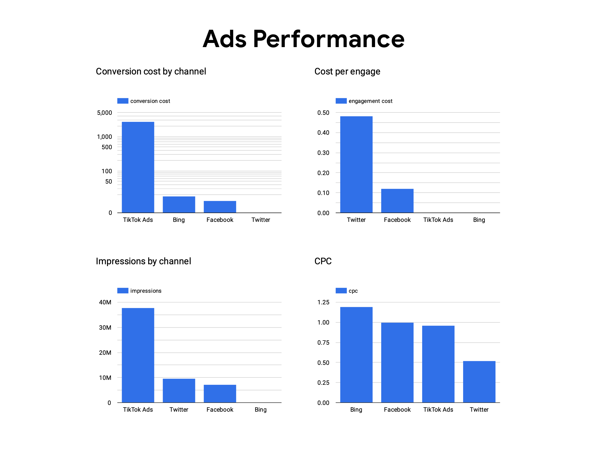
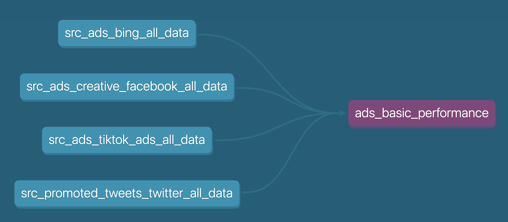
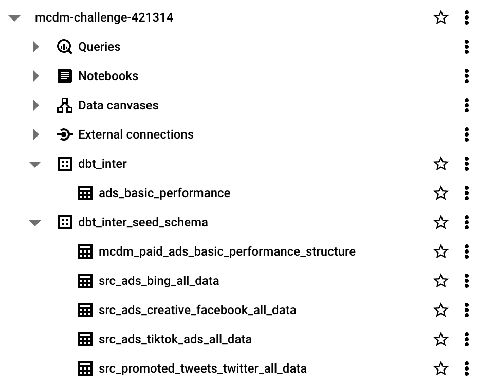
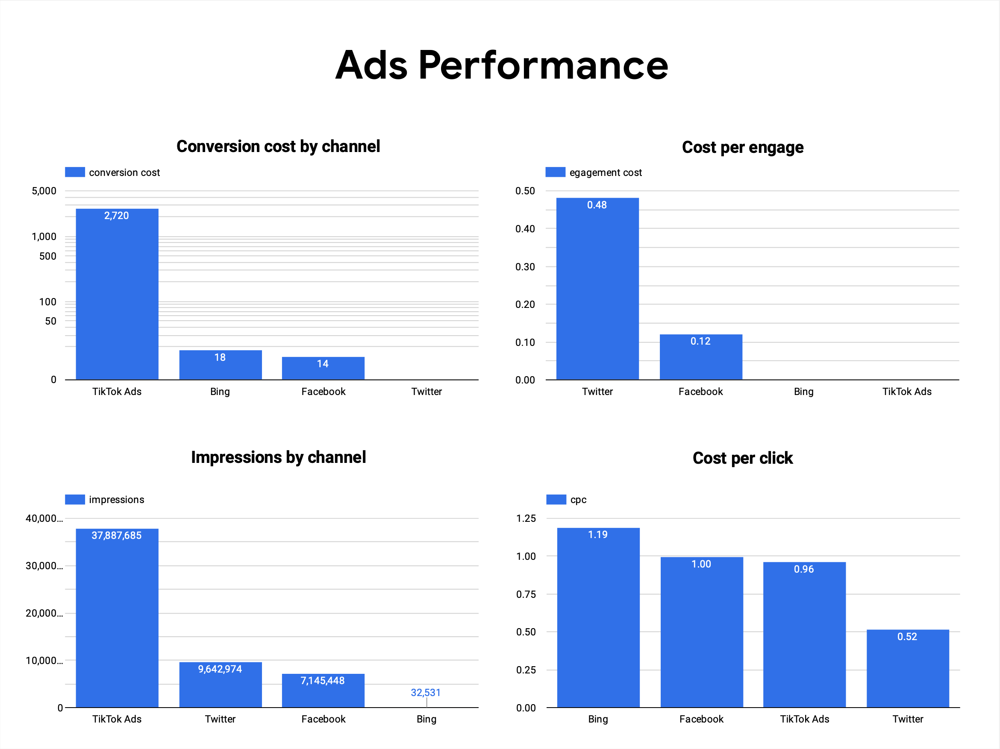

Welcome to the dbt project designed to address the [Marketing Common Data Modelling Challenge](https://github.com/kobzevvv/paid-ads-common-data-model-challenge/tree/main)!

[View the final Looker dashboard here](https://lookerstudio.google.com/s/keV82Qj-Pvw).

**Challenge Overview:** The original models for an existing dashboard were lost. Your task is to rebuild the dbt models using the provided CSV files to recreate the exact same dashboard.  
  
***Old Looker Dashboard*** 

**Provided Files** (located in the [seeds folder](dbt_mcdm_challenge/seeds/)):
- [Ad Performance Table Structure](dbt_mcdm_challenge/seeds/mcdm_paid_ads_basic_performance_structure.csv)
- [Bing Data](dbt_mcdm_challenge/seeds/src_ads_bing_all_data.csv)
- [Facebook Data](dbt_mcdm_challenge/seeds/src_ads_creative_facebook_all_data.csv)
- [TikTok Data](dbt_mcdm_challenge/seeds/src_ads_tiktok_ads_all_data.csv)
- [Twitter Data](dbt_mcdm_challenge/seeds/src_promoted_tweets_twitter_all_data.csv)

**Solution Approach:**
1. Initiated a Google Cloud Project.
2. Set up a separate service account specifically for the dbt project.
3. Launched a dbt project linked to a GitHub repository and integrated with Google BigQuery DWH through a service key.
4. Developed a dbt model that consolidates all fields from each media data source into a unified structure, guided by the provided ad performance table structure.

***DBT Model Dependency Tree*** 

**Key Data Columns Required:**
- **Impressions:** Available across all media data tables.
- **Spend:** Found in each dataset.
- **Clicks:** Consistently present across datasets.
- **Engagements:**
  - Directly available in the Twitter dataset.
  - Calculated for the other three media sources based on activities such as views, likes, shares, comments, inline link clicks, app installations, and registrations, summing these where applicable.
- **Total Conversions:**
  - Identified as 'conversion' in both Bing and TikTok datasets.
  - Represented by the 'purchase' field in the Facebook dataset.
  - Absent in the Twitter dataset.

**Dashboard Development:**
After uploading the processed data to BigQuery, a dashboard was created using Google Looker that displays the following key metrics:
- **Conversion Cost by Channel:** This is determined using the formula `ROUND(SUM(spend) / NULLIF(SUM(total_conversions), 0), 0)`.
- **Cost per Engagement:** This metric is calculated from `SUM(spend) / NULLIF(SUM(engagements), 0)`.
- **Impressions by Channel:** This is the total number of impressions, aggregated with `SUM(impressions)`.
- **Cost per Click:** Calculated through `SUM(spend) / NULLIF(SUM(clicks), 0)`.  
  
***Bigquery Dataset***
  
  
***New Looker Dashboard***  

This setup ensures that all relevant data is processed and visualized effectively, recreating the lost dashboard with accuracy and efficiency.